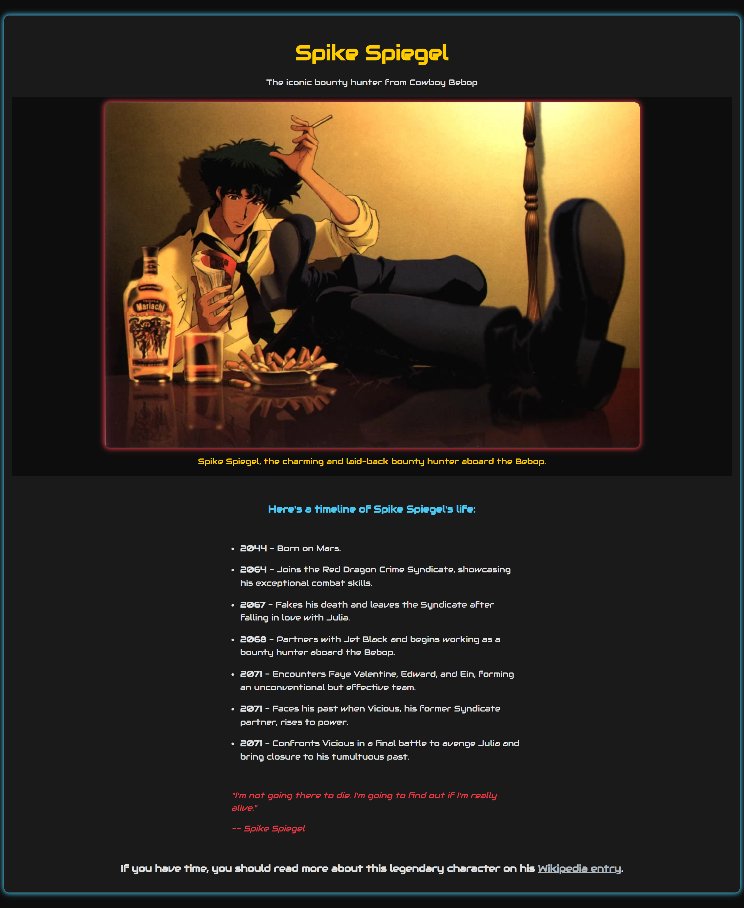

# Cowboy Bebop Tribute - Spike Spiegel

## Table of Contents

- [Overview](#overview)
- [Screenshots](#screenshots)
- [Links](#links)
- [My Process](#my-process)
- [Built With](#built-with)
- [Continued Development](#continued-development)
- [Useful Resources](#useful-resources)
- [Author](#author)

---

## Overview

This is a tribute page dedicated to Spike Spiegel, the main character from the anime **Cowboy Bebop**. The page includes:

- A featured picture of Spike Spiegel.
- A timeline (`<ol>`) detailing key events in his life as portrayed in the show.
- A link to his [Wikipedia page](https://en.wikipedia.org/wiki/Spike_Spiegel) for further reading.

The tribute page is responsive, ensuring an optimal viewing experience across mobile, tablet, and desktop devices.

---

## Screenshots

### Desktop View

### Tablet View

### Mobile View

---

## Links

- **Repository**: [GitHub Repository](https://github.com/dquinn089/fcc-tribute-page)
- **Live Demo**: [Live Link](https://dquinn089.github.io/fcc-tribute-page/)

---

## My Process

1. **HTML Structure**: I started with semantic HTML5 to organize the main sections, including an image, a timeline, and an external link.
2. **CSS Styling**: Used CSS custom properties to style the tribute page, including responsiveness with media queries.
3. **Responsive Design**: Focused on creating a fluid and adaptive layout that works well on all devices.
4. **Content Creation**: Ensured accurate representation of Spike Spiegel's character by referencing the anime and reliable sources like Wikipedia.

---

## Built With

- **Semantic HTML5**: For a structured and accessible layout.
- **CSS Custom Properties**: To style the page and enable responsive design.
- **Responsive Design Techniques**: Using media queries to ensure the page adapts to different screen sizes.

---

## Useful Resources

- **[MDN Web Docs](https://developer.mozilla.org/)**: Excellent resource for HTML and CSS techniques.
- **[W3Schools](https://www.w3schools.com/)**: For quick references on responsive design.
- **Wikipedia**: For sourcing accurate information about Spike Spiegel and Cowboy Bebop.

---

## Author

- **GitHub**: [dquinn089](https://github.com/dquinn089)
- **freeCodeCamp**: [Responsive Web Design](https://www.freecodecamp.org/learn/2022/responsive-web-design/)
